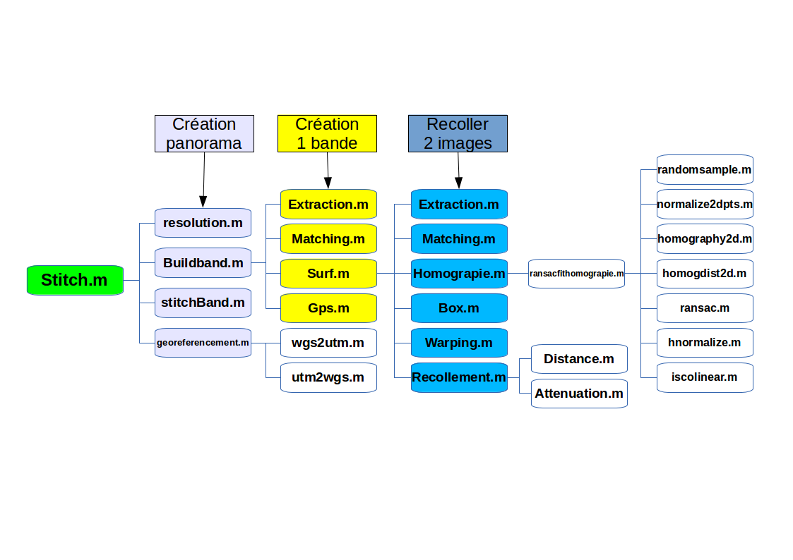
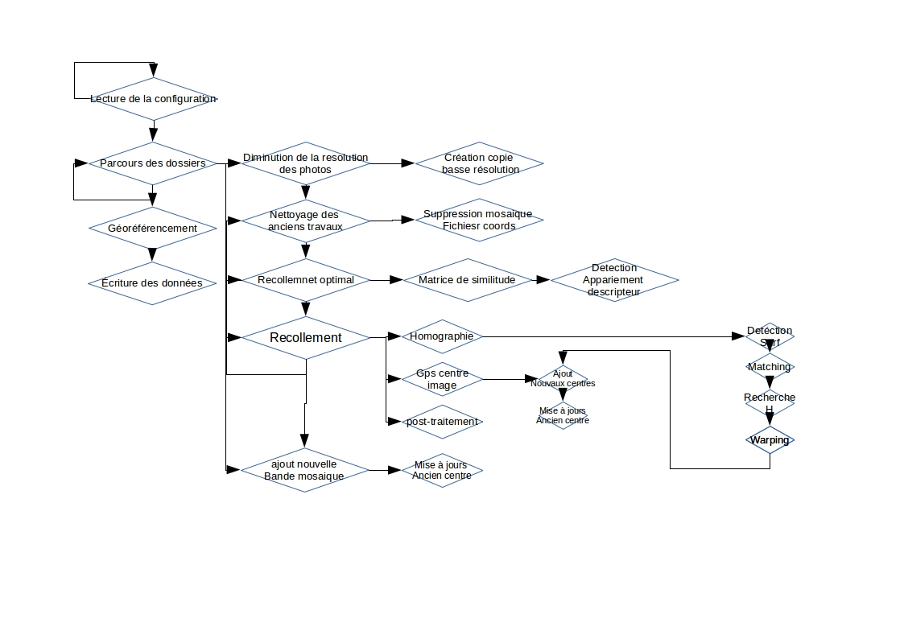
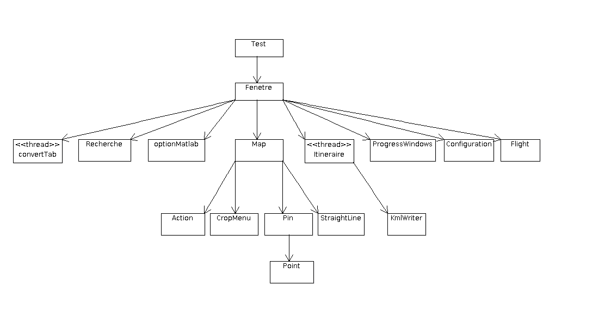
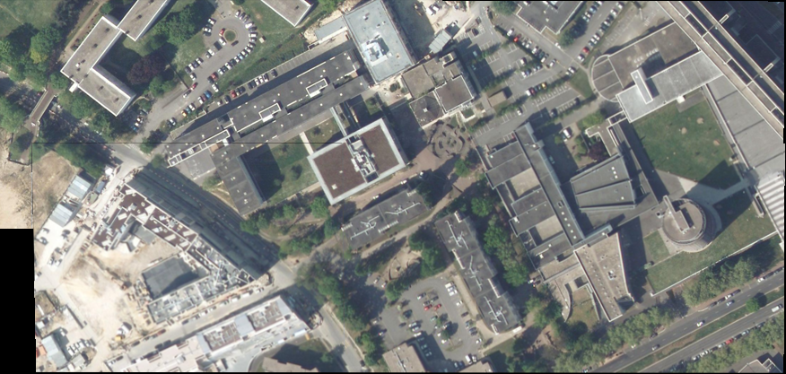
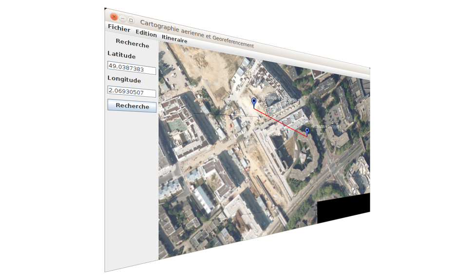

projet_ensea
============

Page de [documentation]
============

[documentation]:http://benoitfragit.github.io/projet_ensea/ "Documentation"

Organisation des fonctions Matlab :
============

Étapes rencontrées lors de la construction du panorama
============

Diagramme UML des classes JAVA :
============

Exemples
============

Interface
============

